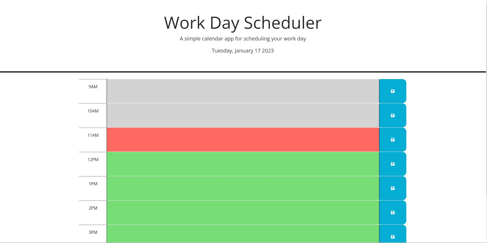

# 5th-challenge-Work-Day-Scheduler

## Description

This project was created to create an application for Work Day Scheduler. It contains notes on HTML, CSS and JavaScript.

I create a simple calendar application that allows a user to save events for each hour of the day that meets certain criteria.

This app runs in the browser, and features dynamically updated HTML and CSS powered by JavaScript code.

I learned how to use day.js to show current day and time. Also I got used to the way storing object in local storage, and getting the object from local storage and use it .

## Installation

N/A

## Usage

To understand the code that I code, please read the comments in JavaScript file.
 

The current day is displayed at the top of the calendar.

Time blocks is presented for standard business hours (9am ~ 5pm).

If you view the time blocks for that day, each time block is color-coded to indicate whether it is in the past (gray), present (red), or future (green).

You can type your 'to do list' on each time block and save it by click save button.

When you refresh the page and the 'to do list' persist in time block.
 

URL = https://kayden-hyunsikkim.github.io/JavaScript-Work-Day-Scheduler/  

(screenshot image could be slitely different with the web application)

## Credits

N/A

## License

N/A